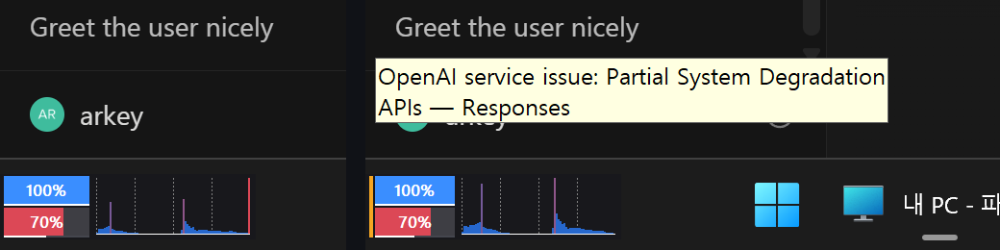
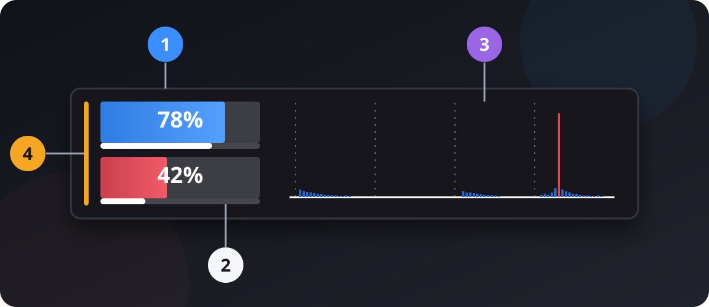
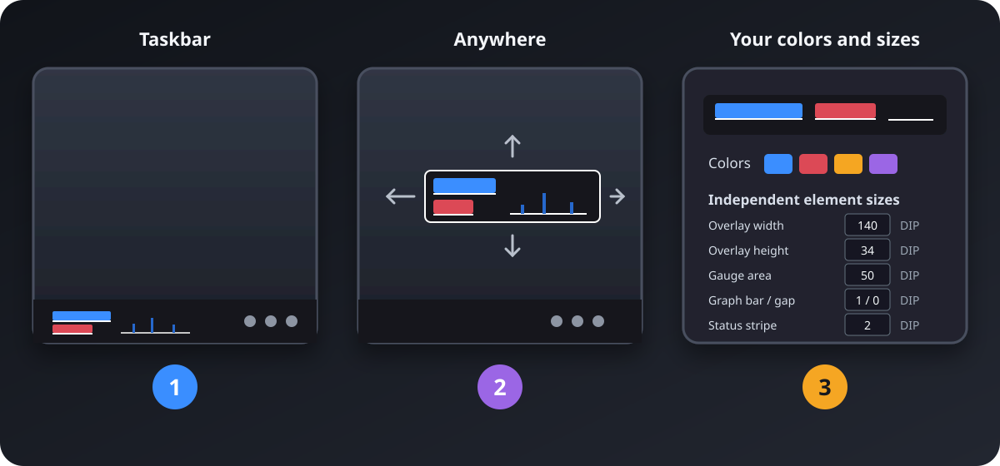

# CodexHp

[English](README.md)

**Codex 사용 한도와 최근 토큰 활동을 Windows 11 작업 표시줄에서 한눈에 확인하세요.**

CodexHp는 Windows 11의 ChatGPT 데스크톱 앱에서 Codex를 사용하는 사람들을 위한 작은 작업 표시줄 오버레이입니다. 다른 창을 열지 않아도 5시간·주간 한도의 남은 사용량, 초기화까지 남은 시간, 로컬 Codex 세션의 최근 활동, OpenAI 서비스 상태를 확인할 수 있습니다.



**[최신 릴리스에서 설치 프로그램 받기](https://github.com/netics01/CodexHp/releases/latest)**

*현재 다운로드 파일은 미서명 상태이므로 Windows 보안 경고가 표시될 수 있습니다. 자세한 내용은 [설치](#설치)를 확인하세요.*

## Codex 사용량을 한눈에



| 번호 | 표시하는 정보 |
| --- | --- |
| **1** | 현재 **5시간 한도**와 **주간 한도**의 남은 사용량 |
| **2** | 각 한도가 초기화될 때까지 남은 시간 |
| **3** | 로컬 Codex 세션에서 읽은 최근 토큰 활동 |
| **4** | OpenAI 서비스 장애 상태. 상태 표시에 마우스를 올리면 영향을 받는 구성 요소 표시 |

활동 그래프를 함께 보면 남은 한도뿐 아니라 최근 사용 패턴도 파악할 수 있습니다. 사용하지 않은 구간, 꾸준히 작업한 구간, 갑작스럽게 사용량이 늘어난 구간을 한눈에 구분할 수 있습니다.

## 어디에나 놓고, 내 환경에 맞추세요



| 번호 | 내 환경에 맞추기 |
| --- | --- |
| **1** | 작업 표시줄에 붙여 언제든 바로 확인 |
| **2** | 작업 표시줄이 불편하다면 연결된 디스플레이 어디로든 자유롭게 이동 |
| **3** | 게이지 색상, 오버레이 크기, 그래프 밀도, 상태 표시를 내 환경에 맞게 조절 |

설정에서 **Overlay Position(오버레이 위치)**을 열고 나타나는 배치 프레임을 드래그하세요. **Colors(색상)**와 **Appearance(모양)**에서 작업 표시줄, 모니터, 취향에 맞는 표시로 조절할 수 있습니다.

## 내 Windows 환경에 맞게

모니터 구성, 작업 표시줄 배치, DPI 배율이 달라져도 저장한 위치를 화면 안에서 사용할 수 있도록 보정하며, 언제 어떻게 표시할지는 사용자가 정할 수 있습니다.

- 설치 시 기본적으로 Windows와 함께 시작하며 업그레이드 후에도 사용자의 선택을 유지합니다.
- 항상 표시하거나 ChatGPT가 실행되는 동안에만 표시할 수 있습니다.
- 같은 모니터에서 전체 화면 앱이 실행되면 자동으로 숨깁니다.
- 오버레이를 두 번 클릭하거나 알림 영역 아이콘을 클릭하면 설정을 엽니다.

> CodexHp가 Windows 환경의 일부가 되고 나면, 그동안 이 프로그램 없이 어떻게 Codex를 썼는지 의아해질지도 모릅니다.

## 설치

1. [최신 GitHub Release](https://github.com/netics01/CodexHp/releases/latest)에서 `CodexHp-Setup-<version>-x64.exe`를 내려받습니다.
2. 현재 사용자용 설치 프로그램을 실행합니다. CodexHp가 `%LocalAppData%\Programs\CodexHp`에 설치되고 시작 메뉴와 제거 항목이 추가됩니다.
3. 설치 프로그램이나 시작 메뉴에서 CodexHp를 실행합니다. Windows 로그인 시 자동 시작이 기본으로 선택되며 설정에서 바꿀 수 있습니다.

설치 없이 실행할 수 있는 `CodexHp-Portable-<version>-x64.exe`도 제공합니다. 자동 실행을 사용하려면 먼저 다운로드 폴더처럼 이동되거나 정리되기 쉬운 위치 밖으로 파일을 옮기세요. CodexHp는 이런 위치에서의 자동 실행 등록을 비활성화합니다.

> [!WARNING]
> 현재 릴리스는 Authenticode 코드 서명이 없습니다. Windows SmartScreen이나 Smart App Control이 경고하거나 차단할 수 있습니다. 이 저장소의 GitHub Release에서만 내려받고 `SHA256SUMS.txt`로 파일을 검증하세요. CodexHp는 아직 WinGet으로 배포하지 않습니다.

PowerShell에서 다음 명령으로 설치 프로그램의 SHA-256 값을 계산한 다음 `SHA256SUMS.txt`의 해당 항목과 비교하세요.

```powershell
Get-FileHash .\CodexHp-Setup-<version>-x64.exe -Algorithm SHA256
```

### 요구 사항

- Windows 11 빌드 22000 이상(x64)
- 설치 및 로그인되어 있고 Codex를 사용할 수 있는 ChatGPT 데스크톱 앱

CodexHp는 ChatGPT 데스크톱 앱의 Codex 환경을 대상으로 합니다. 다른 운영 체제나 일반적인 ChatGPT 대화는 지원하지 않습니다.

## 왜 CodexHp라는 이름인가요?

“HP”는 게임의 체력 게이지에서 따온 이름입니다. Codex를 자주 사용하면 남은 한도는 계속 살펴야 하는 자원처럼 느껴질 수 있습니다. 이름은 재미있지만 목표는 실용적입니다. 한 번 보는 것만으로 계속 작업해도 될지, 다음 초기화까지 사용량을 조절해야 할지 판단할 수 있습니다.

## 데이터와 개인정보

CodexHp는 기존 Codex 인증 캐시 `%CODEX_HOME%\auth.json` 또는 `%USERPROFILE%\.codex\auth.json`과 로컬 Codex 활동 데이터를 읽습니다. 캐시된 토큰은 `chatgpt.com`에서 Codex 사용량을 요청할 때만 사용합니다.

CodexHp는 로그인 과정을 수행하지 않으며 인증 토큰을 설정이나 로그에 저장하거나 CodexHp 개발자가 운영하는 별도 서버로 전송하지 않습니다. CodexHp는 공개 API가 아닌 사용량 엔드포인트와 로컬 활동 형식에 의존하므로 예고 없이 동작이 바뀔 수 있습니다. 인증 정보 처리 방식이 우려된다면 사용 전에 소스 코드와 릴리스 체크섬을 확인하세요.

## 소스에서 빌드

개발에는 `global.json`에 고정된 .NET 10 SDK가 필요합니다. Inno Setup 6은 설치 프로그램을 빌드할 때만 필요합니다.

```powershell
pwsh -NoProfile -File .\scripts\Run-Development.ps1
pwsh -NoProfile -File .\scripts\Verify-Core.ps1
pwsh -NoProfile -File .\scripts\Build-Installer.ps1
```

개발 게시 결과는 `out\win-x64`에, 설치 프로그램은 `out\installer`에 생성됩니다. 두 위치 모두 의도적으로 추적하지 않습니다. 관리자용 공식 릴리스 자산은 이 로컬 명령으로만 빌드합니다. GitHub Actions는 독립적인 CI 검증만 수행하며 별도의 바이너리를 만들지 않습니다.

일반 로컬 빌드는 About에서 **CodexHp-Dev**로 표시됩니다. 릴리스 명령으로 만든 공식 빌드는 **CodexHp**로 표시됩니다.

```powershell
pwsh -NoProfile -File .\scripts\Publish-LocalRelease.ps1 -AllowUnsignedRelease
```

## 프로젝트 상태

CodexHp는 OpenAI와 무관한 비공식 초기 단계 프로젝트입니다. OpenAI와 제휴·보증·지원 관계가 없으며 ChatGPT, Codex, Windows 또는 내부 연동 방식이 변경되면 일부 기능이 일시적으로 동작하지 않을 수 있습니다.

## 피드백

Windows에서 CodexHp가 더 유용해질 수 있는 아이디어가 있나요? 사용 사례나 기능 제안과 함께 [이슈를 등록해 주세요](https://github.com/netics01/codexhp/issues).

## 라이선스

[Apache License, Version 2.0](LICENSE)로 배포됩니다.
