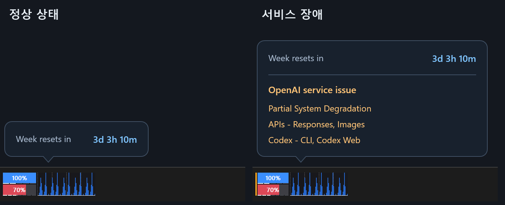
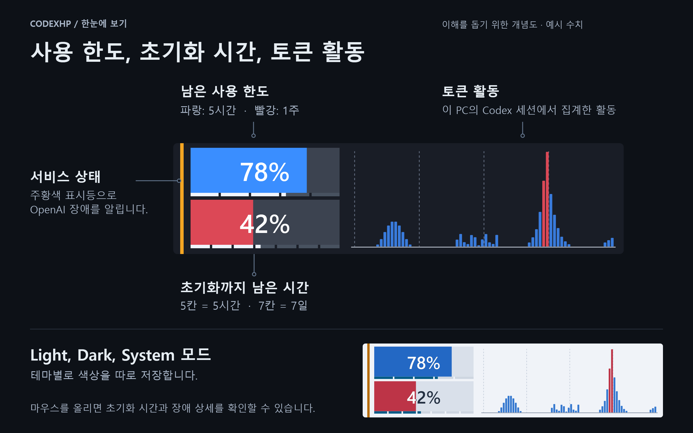
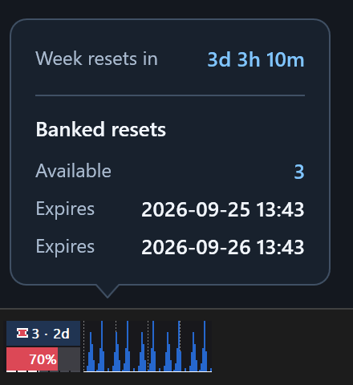
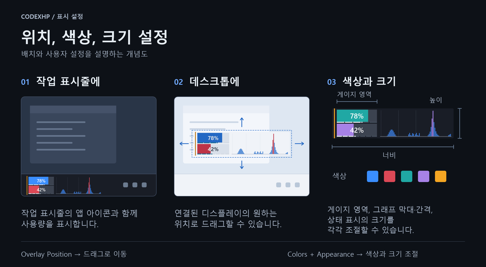

# CodexHp

[English](README.md)

**Windows 11 작업 표시줄에 Codex 사용 한도와 토큰 활동을 표시합니다.**

CodexHp는 Codex를 위한 작은 Windows 오버레이입니다. 별도의 창을 열지 않고도 남은 사용 한도, 초기화까지 남은 시간, 로컬 토큰 활동 그래프를 확인할 수 있습니다. 보유한 초기화권(티켓)의 수량과 만료 시각도 확인할 수 있습니다. 작업 표시줄에 붙이거나 데스크톱의 다른 위치에 배치할 수 있습니다.



*사용량과 서비스 상태를 시뮬레이션한 실제 앱 캡처입니다. 오버레이에 마우스를 올리면 툴팁이 나타납니다.*

**[최신 릴리스에서 설치 프로그램 받기](https://github.com/netics01/CodexHp/releases/latest)**

*현재 다운로드 파일은 미서명 상태이므로 Windows 보안 경고가 표시될 수 있습니다. 자세한 내용은 [설치](#설치)를 확인하세요.*

## Codex 사용량을 한눈에

게이지 패널은 **남은** 5시간·주간 사용 한도를 표시합니다. 각 바 아래의 얇은 초기화 게이지는 5시간과 7일로 나뉩니다. 그래프 패널은 이 PC의 Codex 세션에서 발생한 시간별 토큰 활동을 보여주며, 계정 전체의 사용량이나 요금 합계는 아닙니다.



마우스를 올리면 주간 초기화까지 남은 시간을 확인할 수 있습니다. 5시간 잔여 한도가 100% 미만이면 해당 초기화 시간도 표시합니다. 툴팁은 게이지를 가리지 않도록 오버레이 위나 아래에 배치됩니다. 주황색 표시등은 OpenAI 서비스 장애를 나타내며, 툴팁에서 영향을 받는 서비스를 제품별로 확인할 수 있습니다.

상단 게이지에는 5시간 한도 대신 **초기화권(Banked resets)** 수량과 가장 가까운 만료까지 남은 시간을 표시할 수 있습니다. **Settings → General → Upper bar → Banked resets**에서 선택합니다. 주간 게이지와 활동 그래프는 그대로 유지됩니다.



*초기화권 예시입니다. 마우스를 올리면 가장 가까운 두 만료 시각을 사용자 시간대로 확인할 수 있습니다. CodexHp는 정보를 표시할 뿐 초기화권을 사용하지는 않습니다. 제공 여부는 계정에 따라 다릅니다.*

## 어디에나 놓고, 내 환경에 맞추세요



| 번호 | 설정 |
| --- | --- |
| **1** | Windows 작업 표시줄에 오버레이 배치 |
| **2** | 연결된 디스플레이의 원하는 위치로 이동 |
| **3** | 색상, 오버레이·게이지 크기, 그래프 밀도, 상태 표시 조절 |

설정에서 **Overlay Position(오버레이 위치)**을 열고 나타나는 배치 프레임을 드래그해 위치를 정합니다. **Colors(색상)**에서는 **Light**, **Dark**, **System** 모드를 선택하며 테마별 색상을 따로 저장합니다. **Appearance(모양)**에서는 오버레이와 개별 요소의 크기를 조절합니다.

## 내 Windows 환경에 맞게

CodexHp는 모니터 범위, 작업 표시줄 배치, DPI 변화에 맞춰 저장된 위치를 보정합니다. 언제 표시할지도 선택할 수 있습니다.

- 설치 시 기본적으로 Windows와 함께 시작하며 업그레이드 후에도 사용자의 선택을 유지합니다.
- 항상 표시하거나 ChatGPT가 실행되는 동안에만 표시할 수 있습니다.
- 같은 모니터에서 전체 화면 앱이 실행되면 자동으로 숨깁니다.
- 오버레이를 두 번 클릭하거나 알림 영역 아이콘을 클릭하면 설정을 엽니다.

CodexHp는 시작할 때와 실행 중 7일마다 GitHub의 새 안정 버전을 확인합니다. 새 버전이 있으면 트레이 메뉴에 **Update available**, 설정에 **Update ↗** 항목이 나타납니다. 두 항목 모두 릴리스 페이지를 열며, 자동으로 내려받거나 설치하지 않습니다.

## 설치

1. [최신 GitHub Release](https://github.com/netics01/CodexHp/releases/latest)에서 `CodexHp-Setup-<version>-x64.exe`를 내려받습니다.
2. 현재 사용자용 설치 프로그램을 실행합니다. CodexHp가 `%LocalAppData%\Programs\CodexHp`에 설치되고 시작 메뉴와 제거 항목이 추가됩니다.
3. 설치 프로그램이나 시작 메뉴에서 CodexHp를 실행합니다. Windows 로그인 시 자동 시작이 기본으로 선택되며 설정에서 바꿀 수 있습니다.

설치 없이 실행할 수 있는 `CodexHp-Portable-<version>-x64.exe`도 제공합니다. 자동 실행을 사용하려면 먼저 다운로드 폴더처럼 이동되거나 정리되기 쉬운 위치 밖으로 파일을 옮기세요. CodexHp는 이런 위치에서의 자동 실행 등록을 비활성화합니다.

> [!WARNING]
> 현재 릴리스는 Authenticode 코드 서명이 없습니다. Windows SmartScreen이나 Smart App Control이 경고하거나 차단할 수 있습니다. 이 저장소의 GitHub Release에서만 내려받고 `SHA256SUMS.txt`로 파일을 검증하세요. CodexHp는 아직 WinGet으로 배포하지 않습니다.

PowerShell에서 다음 명령으로 설치 프로그램의 SHA-256 값을 계산한 다음 `SHA256SUMS.txt`의 해당 항목과 비교하세요.

```powershell
Get-FileHash .\CodexHp-Setup-<version>-x64.exe -Algorithm SHA256
```

### 요구 사항

- Windows 11 빌드 22000 이상(x64)
- 설치 및 로그인되어 있고 Codex를 사용할 수 있는 ChatGPT 데스크톱 앱

CodexHp는 ChatGPT 데스크톱 앱의 Codex 환경을 대상으로 합니다. 다른 운영 체제나 일반적인 ChatGPT 대화는 지원하지 않습니다.

## 왜 CodexHp라는 이름인가요?

“HP”는 게임의 체력 게이지에서 따온 이름입니다. CodexHp는 비슷한 시각적 표현으로 남은 사용 한도를 표시합니다. 초기화권 모드에서는 티켓에 주간 게이지와 같은 색을 사용해, 초기화권과 이를 통해 채울 수 있는 한도를 연결해 표현합니다.

## 데이터와 개인정보

CodexHp는 기존 Codex 인증 캐시 `%CODEX_HOME%\auth.json` 또는 `%USERPROFILE%\.codex\auth.json`과 로컬 Codex 활동 데이터를 읽습니다. 캐시된 토큰은 `chatgpt.com`에서 Codex 사용량을 요청할 때만 사용합니다.

서비스 상태는 `status.openai.com`의 공개 데이터로, 새 버전은 GitHub의 릴리스 정보로 확인합니다. 이 요청에는 Codex 인증 토큰을 포함하지 않습니다.

CodexHp는 로그인 과정을 수행하지 않으며 인증 토큰을 설정이나 로그에 저장하거나 CodexHp 개발자가 운영하는 별도 서버로 전송하지 않습니다. CodexHp는 공개 API가 아닌 사용량 엔드포인트와 로컬 활동 형식에 의존하므로 예고 없이 동작이 바뀔 수 있습니다. 인증 정보 처리 방식이 우려된다면 사용 전에 소스 코드와 릴리스 체크섬을 확인하세요.

## 소스에서 빌드

개발에는 `global.json`에 고정된 .NET 10 SDK가 필요합니다. Inno Setup 6은 설치 프로그램을 빌드할 때만 필요합니다.

```powershell
pwsh -NoProfile -File .\scripts\Verify-Core.ps1
.\out\win-x64\CodexHp.exe
```

`Verify-Core.ps1`은 빌드·테스트 후 개발 실행 파일을 `out\win-x64`에 생성합니다. 실행 전에는 이미 실행 중인 CodexHp를 종료하세요. 설치 프로그램은 `pwsh -NoProfile -File .\scripts\Build-Installer.ps1`로 빌드하며 `out\installer`에 생성됩니다. 두 출력 폴더 모두 Git으로 추적하지 않습니다.

일반 로컬 빌드는 About에서 **CodexHp-Dev**로 표시됩니다. 릴리스 명령으로 만든 공식 빌드는 **CodexHp**로 표시됩니다.

개발 빌드에는 사용량, 초기화권, 서비스 장애, 업데이트 알림을 가상으로 재현하는 독립된 [시뮬레이션 도구](docs/development-simulation.md)도 포함됩니다. 공식 다운로드에는 포함하지 않습니다.

관리자용 공식 릴리스 자산은 아래 로컬 명령으로만 빌드합니다. GitHub Actions는 독립적인 CI 검증을 수행하며 별도의 릴리스 바이너리를 만들지 않습니다.

```powershell
pwsh -NoProfile -File .\scripts\Publish-LocalRelease.ps1 -AllowUnsignedRelease
```

## 프로젝트 상태

CodexHp는 OpenAI와 무관한 비공식 초기 단계 프로젝트입니다. OpenAI와 제휴·보증·지원 관계가 없으며 ChatGPT, Codex, Windows 또는 내부 연동 방식이 변경되면 일부 기능이 일시적으로 동작하지 않을 수 있습니다.

## 피드백

Windows에서 CodexHp가 더 유용해질 수 있는 아이디어가 있나요? 사용 사례나 기능 제안과 함께 [이슈를 등록해 주세요](https://github.com/netics01/codexhp/issues).

## 라이선스

[Apache License, Version 2.0](LICENSE)로 배포됩니다.
