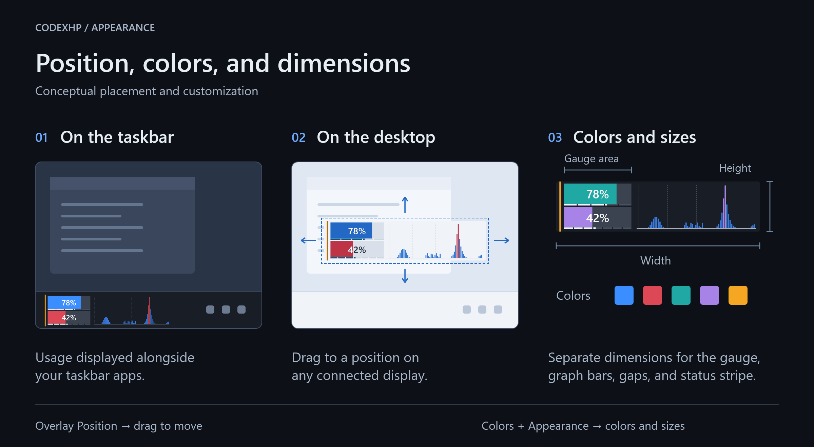

# CodexHp

[한국어](README.ko.md)

**Codex usage limits and token activity on the Windows 11 taskbar.**

CodexHp is a small Windows overlay for Codex. It shows remaining usage limits, reset countdowns, and a graph of local token activity without opening a separate window. You can also view your available reset credits (banked resets) and when they expire. Keep it on the taskbar or place it elsewhere on your desktop.


*Actual app captures with simulated usage and service status. The tooltip appears when you hover over the overlay.*

**[Get the latest release](https://github.com/netics01/CodexHp/releases/latest)**

*Current downloads are unsigned and may trigger a Windows security warning. See [Install](#install) for details.*

## Codex usage at a glance

The gauge panel shows your **remaining** 5-hour and weekly limits. Thin reset gauges below the bars are divided into five hours and seven days. The graph panel shows token activity over time from Codex sessions on this PC; it is not an account-wide usage or billing total.


Hover for the weekly reset countdown and, when the 5-hour limit is below 100% remaining, its countdown too. The tooltip is placed above or below the overlay so it does not cover the gauges. An orange indicator marks an OpenAI service issue; the tooltip lists affected services by product.

The upper gauge can instead show **banked resets**: the number of available reset credits and the time until the next known expiry. Select **Settings → General → Upper bar → Banked resets**. The weekly gauge and activity graph remain visible.


*Simulated reset credits. Hover to see the two nearest expiry times in your local time zone. CodexHp displays this information; it does not redeem credits. Availability depends on your account.*

## Put it anywhere. Make it yours.



| No. | Setting |
| --- | --- |
| **1** | Place the overlay on the Windows taskbar |
| **2** | Move it to a position on any connected display |
| **3** | Adjust colors, overlay and gauge dimensions, graph density, and the status indicator |

Open **Overlay Position** in Settings and drag the outlined overlay to place it. **Colors** offers **Light**, **Dark**, and **System** modes, with colors saved separately for each theme. **Appearance** controls the size of the overlay and its individual elements.

## Fits your Windows setup

CodexHp adjusts saved placement for monitor bounds, taskbar layouts, and DPI changes. You can also choose when it is visible.

- Starts with Windows by default when installed, and preserves your choice during upgrades.
- Can stay visible all the time or appear only while ChatGPT is running.
- Hides automatically when a full-screen app is active on the same monitor.
- Opens settings when you double-click the overlay or click its notification-area icon.

CodexHp checks GitHub for a newer stable release at startup and every seven days while running. When one is available, **Update available** appears in the tray menu and **Update ↗** appears in Settings. Both open the release page; nothing is downloaded or installed automatically.

## Install

1. Download `CodexHp-Setup-<version>-x64.exe` from the [latest GitHub Release](https://github.com/netics01/CodexHp/releases/latest).
2. Run the per-user installer. It places CodexHp under `%LocalAppData%\Programs\CodexHp` and adds Start menu and uninstall entries.
3. Launch CodexHp from the installer or Start menu. Starting automatically when you sign in is selected by default and can be changed in Settings.

`CodexHp-Portable-<version>-x64.exe` is also available for temporary use. Move the portable build out of Downloads or other temporary locations before enabling Windows startup; CodexHp disables startup registration from locations likely to be cleaned or moved.

> [!WARNING]
> The current release is not Authenticode-signed. Windows SmartScreen or Smart App Control may warn about or block it. Download only from this repository's GitHub Release and verify the files against `SHA256SUMS.txt`. CodexHp is not yet distributed through WinGet.

To calculate the installer's SHA-256 digest in PowerShell, run the following command and compare the result with the matching entry in `SHA256SUMS.txt`:

```powershell
Get-FileHash .\CodexHp-Setup-<version>-x64.exe -Algorithm SHA256
```

### Requirements

- Windows 11 build 22000 or later (x64)
- The ChatGPT desktop app installed, signed in, and able to use Codex

CodexHp is built for the Codex experience in the ChatGPT desktop app. It does not support other operating systems or ordinary ChatGPT conversations.

## Why the name CodexHp?

“HP” comes from health bars in games. CodexHp uses a similar visual shorthand for your remaining usage limit. In reset-credit mode, the ticket uses the weekly gauge's color to connect the credit with the limit it can replenish.

## Data and privacy

CodexHp reads the existing Codex authentication cache from `%CODEX_HOME%\auth.json` or `%USERPROFILE%\.codex\auth.json` and local Codex activity data. It uses the cached token only to request Codex usage data from `chatgpt.com`.

It also requests public service-status data from `status.openai.com` and release information from GitHub. Those requests do not include your Codex authentication token.

CodexHp does not perform sign-in, store the authentication token in its settings or logs, or send it to a separate server operated by the CodexHp developer. It relies on a non-public usage endpoint and local activity formats that may change without notice; CodexHp can stop working if they do. If credential handling is a concern, review the source and release checksums before using the app.

## Build from source

Development requires the .NET 10 SDK pinned by `global.json`. Inno Setup 6 is required only to build the installer.

```powershell
pwsh -NoProfile -File .\scripts\Verify-Core.ps1
.\out\win-x64\CodexHp.exe
```

`Verify-Core.ps1` builds, tests, and publishes the development executable to `out\win-x64`. Exit any running CodexHp instance before launching it. To build an installer, run `pwsh -NoProfile -File .\scripts\Build-Installer.ps1`; its output goes to `out\installer`. Both output directories are untracked.

Regular local builds identify themselves as **CodexHp-Dev** in About. The official build created by the release command identifies itself as **CodexHp**.

Development builds also include an isolated [simulation tool](docs/development-simulation.md) for sample usage, reset credits, service incidents, and update notifications. It is not included in official downloads.

For maintainers, official release assets are built only by the following local command. GitHub Actions runs independent CI checks and does not create a second set of release binaries.

```powershell
pwsh -NoProfile -File .\scripts\Publish-LocalRelease.ps1 -AllowUnsignedRelease
```

## Project status

CodexHp is an unofficial early-stage project independent of OpenAI. It is not affiliated with, endorsed by, or supported by OpenAI. Changes to ChatGPT, Codex, Windows, or their internal integration details may temporarily break some features.

## Feedback

Have an idea that would make CodexHp more useful on Windows? Please [open an issue](https://github.com/netics01/codexhp/issues) with your use case or feature request.

## License

Licensed under the [Apache License, Version 2.0](LICENSE).
